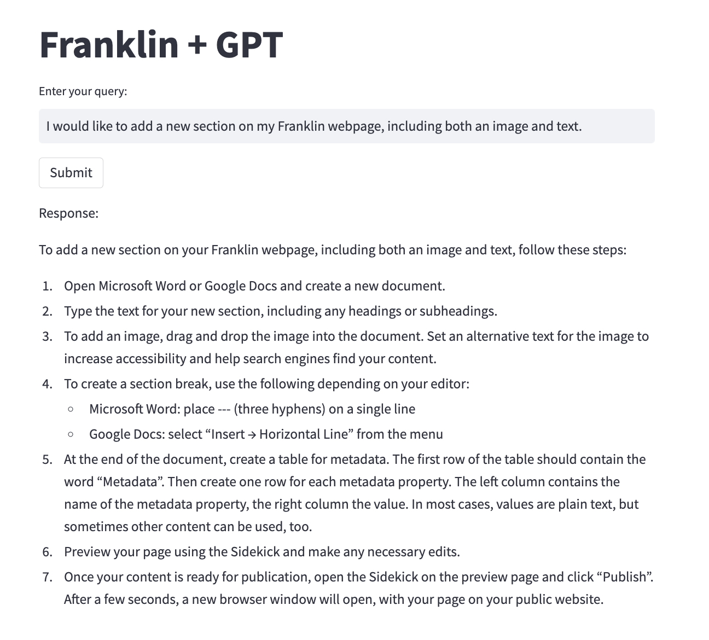

# llm_franklindocs_streamlitapp

1- Set your ‘OPENAI_API_KEY’ as an environment variable.
```
openai.api_key  = os.getenv('OPENAI_API_KEY')
```

2- Run this on terminal
```
steamlit run franklin_webpage.py 
```
this app runs on http://localhost:8501/

3- Enter your query 
  e.g. I would like to add a new section on my Franklin webpage, including both an image and text.
  
  
